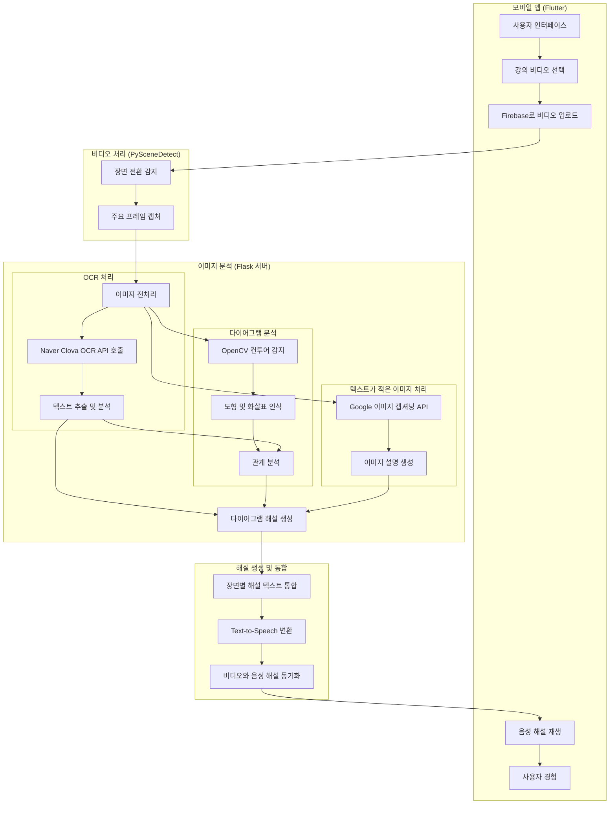

# LectureVoice: 시각 장애 학생을 위한 자동 강의 해설 시스템

LectureVoice는 시각 장애 학생들에게 강의 영상의 시각적 요소를 자동으로 해설해주는 오디오 솔루션입니다. 영상 내 다이어그램, 표, 그래프 및 텍스트를 분석하여 의미 있는 음성 설명을 생성함으로써 시각적 콘텐츠에 대한 접근성을 높입니다.

## 기술 스택

### 프론트엔드
- **Flutter & Dart**: 크로스 플랫폼 모바일 애플리케이션 개발
- **Firebase Storage**: 이미지 및 비디오 저장

### 백엔드
- **Python**: 주 백엔드 언어
- **Flask**: 경량 웹 서버 프레임워크, RESTful API 구현
- **OpenCV (cv2)**: 이미지 처리, 다이어그램 분석, 윤곽선 감지
- **PySceneDetect**: 비디오에서 장면 전환 감지
- **NumPy**: 수치 계산 및 배열 처리

### API 서비스
- **Naver Clova OCR API**: 이미지에서 텍스트 추출
- **Google Cloud Image Captioning API**: 이미지 설명 생성
- **Google Cloud Text-to-Speech API**: 텍스트를 음성으로 변환

### 저장소
- **Firebase Realtime Database**: 사용자 데이터 및 해설 저장
- **Firebase Authentication**: 사용자 인증

## 시스템 작동 방식

1. **비디오 분석** - 사용자가 업로드한 강의 영상은 PySceneDetect를 사용해 장면 전환을 감지하고, 중요 프레임을 캡처합니다.

2. **이미지 처리** - 캡처된 프레임은 Flask 서버에서 다음과 같이 처리됩니다:
   - OpenCV를 사용한 이미지 전처리 (가우시안 블러, 케니 엣지 검출 등)
   - 컨투어 감지를 통한 도형과 화살표 인식
   - 인식된 도형과 화살표 간의 관계 분석

3. **텍스트 인식** - Naver Clova OCR API를 사용하여 이미지에서 텍스트를 추출합니다.

4. **다이어그램 해석** - 커스텀 알고리즘을 활용하여:
   - 화살표, 사각형, 기타 도형 인식
   - 도형 간의 관계 파악
   - 텍스트와 도형의 연관성 분석
   - 구조화된 설명 생성

5. **표 분석** - 격자 구조를 인식하고 셀 내용을 추출하여 체계적인 해설을 생성합니다.

6. **이미지 캡셔닝** - 다이어그램이 아닌 일반 이미지는 Google Cloud Image Captioning API를 사용하여 설명합니다.

7. **해설 생성** - 추출된 모든 정보를 종합하여 시각 장애인이 이해하기 쉬운 내러티브 형식의 해설을 생성합니다.

8. **음성 변환** - 생성된 해설은 TTS API를 통해 음성으로 변환됩니다.

## 핵심 구성 요소

### 다이어그램 분석 알고리즘
- **윤곽선 감지**: 이미지에서 도형의 윤곽선을 검출하고 분류합니다.
- **화살표 감지**: 화살표의 시작점, 끝점, 방향을 식별합니다.
- **관계 분석**: 화살표로 연결된 도형 간의 관계를 분석합니다.
- **텍스트 매핑**: 도형 내부 및 주변의 텍스트를 관련 도형과 연결합니다.

### 장면 감지 및 이미지 추출
PySceneDetect API를 활용하여 비디오의 장면 전환을 감지하고, 각 장면에서 대표 프레임을 추출합니다. 이는 강의 내용의 시각적 구조를 이해하는 데 중요합니다.

### OCR 및 텍스트 처리
Naver Clova OCR API로 이미지에서 텍스트를 추출하고, 위치 정보와 함께 텍스트의 내용을 구조화합니다. 이는 다이어그램의 의미 해석에 중요한 역할을 합니다.

## 결과 및 영향

LectureVoice는 시각 장애 학생들의 학습 경험을 크게 향상시키는 솔루션으로, 기존의 일반적인 이미지 캡셔닝 방식보다 더 상세하고 맥락에 맞는 다이어그램 설명을 제공합니다. 특히 컴퓨터 과학, 수학, 공학 등 시각적 정보가 중요한 학문 분야에서 학습 접근성을 크게 향상시킵니다.

휴대성과 사용 편의성을 고려한 모바일 앱 기반 설계로, 시각 장애 학생들은 언제 어디서나 학습 콘텐츠에 접근할 수 있습니다.

## FlowChart

